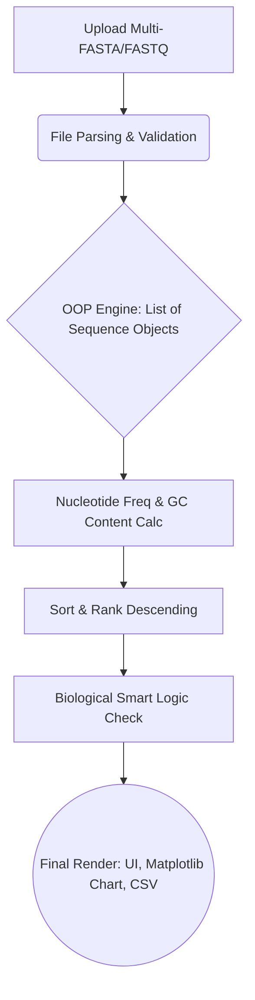

# BioSeq Analyzer: Advanced Thermophilic Sequence Screening

[](https://python.org)
[](https://flask.palletsprojects.com/)
[](https://www.pythonanywhere.com/)
[](#)

**BioSeq Analyzer** bukan sekadar *script* pembaca FASTA biasa. Ini adalah **Platform Web Bioinformatika Berbasis Cloud** yang mengintegrasikan ekstraksi data sekuens menggunakan konsep *Object-Oriented Programming* (OOP), komputasi termodinamika nukleotida, dan antarmuka UI/UX interaktif dalam satu *pipeline* otomatis.

Berbeda dengan sistem konvensional yang berjalan di *localhost*, *engine* ini telah **di-deploy secara global (Cloud-Based)**, memungkinkan evaluasi termofilik secara instan dari berbagai perangkat (Mobile/Desktop) tanpa memerlukan instalasi *environment* lokal.

---

## ✨ Fitur Unggulan & Inovasi Sistem

Aplikasi ini melampaui ekspektasi *script* dasar dengan menghadirkan fitur standar industri perangkat lunak modern:

- ☁️ **Global Cloud Deployment:** Berjalan 24/7 di *server* PythonAnywhere, membebaskan *user* dari kerumitan instalasi dependensi (seperti Biopython atau Matplotlib) di komputer lokal.
- 🧠 **Dynamic Biological Insight Engine (Smart Logic):** Sistem dilengkapi algoritma logika bersyarat (If-Else) pada Jinja2 untuk memberikan interpretasi biologis otomatis:
  - **GC ≥ 60%:** Diklasifikasikan sebagai **Termofilik Kuat** (ideal untuk panen enzim *Taq Polymerase* / industri suhu tinggi).
  - **40% ≤ GC < 60%:** Diklasifikasikan sebagai **Mesofilik** (stabil di suhu ruang).
  - **GC < 40%:** Peringatan struktur DNA rentan (*AT-rich*) yang mudah terdenaturasi.
- 🌗 **Persistent Dark Mode (UI/UX):** Menggunakan *LocalStorage Browser* dan integrasi JavaScript untuk menyimpan preferensi tema pengguna, menjamin transisi antar-halaman yang mulus tanpa *flash-bang* putih.
- 📊 **Automated Visual & Data Export:** Secara *real-time* men- *generate* visualisasi perbandingan (Bar Chart) dan mengekspor objek analisis ke dalam laporan CSV yang siap diunduh.

---

## 🏗️ Arsitektur Berbasis OOP (Object-Oriented)

Proyek ini menstrukturkan beban komputasi menggunakan prinsip OOP yang rapi dan terukur:

1. `SequenceRecord Model`: Entitas objek yang bertanggung jawab menyimpan metadata satu sekuens (ID, Panjang Basa) sekaligus merangkum fungsi kalkulasi frekuensi absolut (A, T, G, C) dan persentase *GC Content*.
2. `DataParser & Analyzer Engine`: Kelas fungsional yang bertugas mengekstraksi file `.fasta`/`.fastq`, memvalidasi ekstensi, mengonversinya menjadi *List of Objects*, serta melakukan metode *Sorting* (peringkat Top 3) secara komputasional.
3. `Visualization & Export Handler`: Bertanggung jawab atas *rendering* grafik distribusi menggunakan pustaka *Matplotlib* dan penulisan matriks data ke format `.csv` di *server*.

---

## ⚙️ Skema Pipeline Komputasi

Berikut adalah alur kerja *backend* saat pengguna mengunggah spesimen:



## 📂 Struktur Direktori Proyek
```text
BIOSEQ_ANALYZER/
├── app.py                  # Entry point Flask & Controller utama
├── core/
│   └── sequence_utils.py   # Modul OOP & Logika Komputasi Bioinformatika
├── static/
│   ├── css/
│   │   └── style.css       # Custom styling, Animasi, & Dark Mode engine
│   ├── plots/              # Direktori penyimpanan grafik ter-generate
│   └── uploads/            # Direktori output laporan CSV
├── templates/
│   ├── base.html           # Master layout & JavaScript persistence
│   ├── index.html          # UI Landing page & Upload zone
│   └── result.html         # UI Dashboard hasil & Insight dinamis
├── requirements.txt        # Dependensi library (Flask, Biopython, Matplotlib)
└── README.md               # Dokumentasi proyek
```

> *"Transforming raw DNA sequences into actionable biological insights."* > **Developed for Bioinformatics Project | 2026**